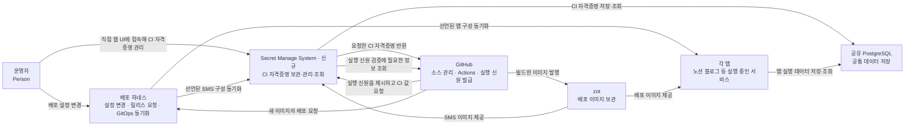
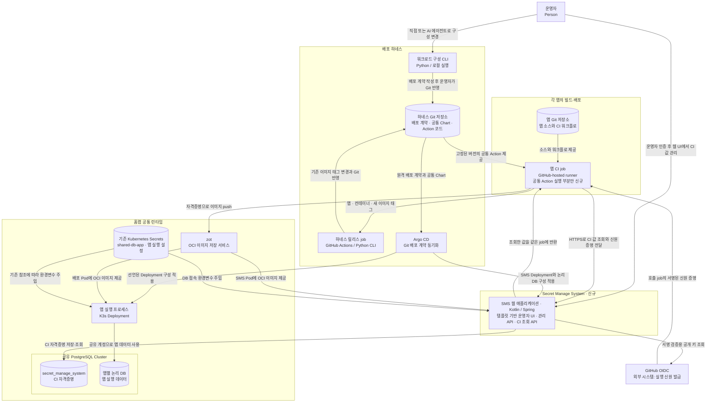

# 홈랩 하네스 전체 설계

상태: SMS 배포와 공통 Action `v1.0.0` 게시 완료. 노션 블로그 CI에 SMS 조회를 적용했다. 운영 기준일: 2026-09-11.

## 문서의 수준과 검토 기준

이 문서는 C4의 **시스템 관계(L1)와 컨테이너(L2)** 수준에서 각 요소의 책임과 연결을 설명한다. 두 수준은 별도 다이어그램으로 구분한다. C4의 컨테이너는 실행 프로그램이나 데이터 저장소를 뜻하며 Docker 컨테이너와 같은 뜻이 아니다. 공통 Action은 CI job 안에서 실행되는 코드이므로 독립 서버로 그리지 않는다.

| 문서 | 대상 독자와 추상화 수준 | 포함하는 내용 | 포함하지 않는 내용 |
| --- | --- | --- | --- |
| 이 문서 | 시스템을 이해하는 운영자·개발자; L1/L2 | 관계, 실행·저장 책임, 데이터 흐름, 기능 경계 | API 필드, SQL, Action 파일 내용 |
| [Secret Manage System](docs/SECRET_MANAGE_SYSTEM.md) | 하네스 배포 담당자와 Action 구현자; SMS를 하나의 서비스로 보는 외부 계약 | CI 조회 API·인증, 운영자 직접 관리 경로, 배포 입력·저장 책임 | 내부 DB 스키마, 관리 API·UI 상세, 전체 CI YAML, 클래스·메서드 설계 |
| [공통 GitHub Action](docs/GITHUB_ACTION.md) | Action 구현자와 앱 CI 작성자; L3 컴포넌트와 사용 계약 | 입력, 실행 책임, 패키지와 호출 예시 | DB 스키마·운영, 시크릿 관리 앱 내부 구현 |
| [워크로드 플랫폼 설계](docs/WORKLOAD_PLATFORM.md) | 기존 하네스를 운영·확장하는 운영자와 AI 에이전트; 이번 설계 이전부터 유지되는 기준 문서 | 워크로드 계약과 처리 흐름, 공유 DB·레지스트리 모델, 에이전트·CI 인터페이스 계약, Argo CD 정책 | SMS, 공통 Action, CI 자격증명 조회 |

C4의 수준은 문서의 관심사를 정하는 기준으로 사용한다. HTTP·JSON·YAML 예시는 해당 상세 문서의 외부 계약을 설명하기 위해 사용하며, 모든 문서를 클래스 수준까지 확장하지 않는다. [C4의 수준](https://c4model.com/diagrams), [컨테이너의 의미](https://c4model.com/diagrams/container)

작성 전 정한 전체 설계 검토 기준:

- **O1 — 수준:** L1에는 사람·시스템, L2에는 실행 단위·저장소와 직접 연결된 사람·외부 시스템만 표시한다.
- **O2 — 관계:** 각 화살표는 누가 무엇을 주거나 요청하는지 설명한다. Action은 호출 앱의 CI job 안에 있고, GitHub가 실행 신원을 발급한다.
- **O3 — 경계:** 운영자는 SMS에서 CI 값을 직접 관리하고 하네스는 관리 API를 호출하지 않는다. CI 자격증명 전달과 배포된 앱의 실행 설정을 구분하며, SMS에서 앱의 Kubernetes Secret으로 이어지는 쓰기 경로는 없다.
- **O4 — 단순화:** 앱 간 격리 최소화, 공통 자격증명 공유, GitHub-hosted runner 사용을 유지한다. 앱별 ACL이나 셀프 호스팅 러너를 추가하지 않는다.
- **O5 — 일관성:** 상세 계약은 두 하위 문서가 소유한다. 기존 구성·신규 설계·검증 완료 여부를 구분하고 깨진 링크나 서로 다른 계약을 남기지 않는다.

## 목적과 원칙

각 앱 레포의 GitHub Secrets에 같은 레지스트리 계정과 하네스 호출 토큰을 반복 보관하는 일을 줄인다. Secret Manage System(이하 시크릿 관리 앱)에 CI 자격증명을 보관하고, 허용된 GitHub Actions 실행이 공통 Action으로 필요한 값을 가져간다.

**제1원칙은 앱 간 격리 최소화다.** 단일 운영자의 앱과 허용 레포를 함께 신뢰한다. 앱 이름은 값을 선택하는 구분이며 권한 경계가 아니다. 허용된 실행은 다른 앱 이름의 CI 자격증명도 조회할 수 있고, 각 CI가 필요한 항목을 선택한다. 한 허용 실행이 침해되면 보관된 CI 자격증명 전체가 영향을 받을 수 있다. 외부 접근 인증과 Git·로그로의 비밀 값 노출 방지는 유지한다.

- 배포 대상은 기존 공통 Helm Chart가 지원하는 Deployment 기반 앱이다. AI 에이전트는 기존 CLI로 배포 계약을 변경하고, 앱 CI는 기존 릴리스 경로로 이미지 태그만 갱신한다. 이 기존 하네스의 계약과 정책은 [워크로드 플랫폼 설계](docs/WORKLOAD_PLATFORM.md)가 정의하며 이번 설계로 바뀌지 않는다.
- 앱별 namespace와 논리적 DB 이름은 운영상의 구분이다. PostgreSQL 인스턴스·계정과 레지스트리 계정은 공유한다.
- 시크릿 관리 앱은 운영자의 CI 자격증명 관리와 허용된 CI의 조회에 한정한다. 앱 실행용 Kubernetes Secret의 생성·등록·자동 갱신은 하지 않는다.
- OpenBao, Spring Cloud Config Server, ARC, DinD 러너 인프라는 이번 설계에 포함하지 않는다.

## L1 — 시스템 관계

아래는 전체 관계를 보여주는 시스템 랜드스케이프다. 사람과 소프트웨어 시스템만 표시하며 내부 파일·프로세스와 논리 DB 구분은 다음 수준에서 설명한다. `신규` 표시가 없는 시스템은 기존 배포 경로에 있다.

## L2 — 컨테이너 수준 시스템 랜드스케이프

아래는 같은 기능을 실행 프로그램과 저장소로 확대한 논리 구조다. 경계는 관리 책임을 나타내며 물리 노드·Pod 개수·Ingress 규칙을 표현하는 배포도는 아니다. `신규` 부분만 이번 설계가 추가하며, 공통 Action은 기존 앱 CI job의 일부가 된다.

| 요소 | 책임과 실행 범위 |
| --- | --- |
| 각 앱 레포와 앱 CI | 앱을 검증·빌드하고, 필요한 CI 값을 조회해 이미지 발행과 릴리스 요청에 사용한다. |
| 공통 GitHub Action · 신규 | 호출한 앱의 job 안에서 인증·조회·응답 처리·마스킹·환경변수 전달을 수행한다. 별도 job이나 서버가 아니다. |
| GitHub OIDC | 실행 출처를 증명한다. Secret 저장소도 아니며 홈서버로의 네트워크 연결을 제공하지도 않는다. |
| Secret Manage System · 신규 | 운영자가 직접 사용하는 템플릿 기반 UI·관리 API와 CI 조회 API를 제공한다. 운영자 인증과 CI OIDC 조회 권한을 구분하며, 앱 레포별로 조회 권한을 나누지 않는다. |
| 공유 PostgreSQL · 기존 | `secret_manage_system`과 앱별 논리 DB를 같은 Cluster에 두고, 인스턴스와 `defaultuser` 계정을 공유한다. |
| 워크로드 구성 CLI | 운영자나 AI 에이전트가 기존 앱 계약을 생성·수정한다. CLI의 파일 변경과 운영자의 Git 반영은 별도 단계다. |
| 하네스 Git·릴리스 job·Argo CD | 기존 이미지 태그 변경과 GitOps 배포를 계속 담당한다. 시크릿 관리 앱이 이 경로를 대체하지 않는다. |
| zot | 같은 공통 계정으로 이미지 발행과 pull을 지원한다. 계정 자체의 권한은 기존과 같다. |
| 앱 실행 프로세스·기존 Secrets | 기존 앱의 런타임 설정을 유지하고, `shared-db-app` 접속 정보는 기존 계약으로 SMS에도 주입한다. CI에서 받은 값은 앱 Pod에 자동 주입하지 않는다. |

## 주요 흐름과 책임 경계

1. 운영자는 SMS 웹 UI에 직접 접속해 원래 발급받은 CI 자격증명을 등록·교체·삭제한다. SMS가 관리 API와 저장을 담당하며 하네스·공통 Action은 관리 API를 호출하지 않는다. CI 값의 발급과 입력은 별개이며, GitHub에 저장된 Secret의 평문을 API로 다시 읽어오는 방식은 사용하지 않는다.
2. 허용된 앱 CI job에서 공통 Action이 GitHub의 실행 신원을 받아 시크릿 관리 앱에 제시한다. 그 신원은 Action 코드가 있는 하네스가 아니라 호출한 앱의 실행을 나타낸다.
3. 시크릿 관리 앱은 실행을 허용할지 판단한 뒤 요청한 앱 이름의 값을 반환한다. 공통 Action은 이를 같은 job의 후속 step에 전달한다.
4. 앱 CI는 받은 값으로 zot에 이미지를 발행하고 기존 하네스 릴리스 워크플로를 호출한다. 하네스가 Git의 이미지 태그를 변경하면 Argo CD가 앱을 동기화한다.
5. 배포된 앱은 기존 Kubernetes Secret 참조와 공유 DB 접속 방식을 계속 사용한다. CI에서 받은 값을 새 Kubernetes Secret으로 만들거나 앱 Pod에 자동 주입하지 않는다.

공통 값은 값을 제공하는 시스템 이름으로 한 번 보관한다. 예를 들어 노션 블로그 CI는 레지스트리용 값과 하네스 호출용 값을 각각 조회한다. 이를 각 소비 앱 이름 아래에 반복 복사할 필요가 없다.

## 운영 전제와 장애 영향

- 앱 CI와 하네스 릴리스 job은 GitHub-hosted runner를 사용한다. 이전 ARC 추가 계획과 관련 스테이징 변경은 제거한다.
- 시크릿 관리 앱은 단일 인스턴스로 시작하고 기존 공유 PostgreSQL의 `secret_manage_system` 논리 DB를 사용한다. 별도 DB 인스턴스·계정·고가용성·자동 장애조치는 추가하지 않는다. 구체적인 저장 계약은 [저장 설계](docs/SECRET_MANAGE_SYSTEM.md)를 따른다.
- 앱 CI에서 시크릿 관리 앱과 zot 양쪽으로 접속 가능해야 한다. OIDC와 네트워크 연결은 별개이며, 한쪽만 연결됐다고 전체 배포가 가능하지는 않다. 시크릿 관리 앱은 HTTPS를 사용한다. VPN을 추가한다면 네트워크 접근 수단으로 다루며 OIDC를 대체하지 않는다.
- 시크릿 관리 앱이나 DB가 중단되면 새로운 CI 값 조회가 실패한다. 이미 실행 중인 앱은 이 서비스에 의존하지 않는다. 같은 job이 이미 받은 정적 자격증명이 서비스 중단만으로 무효화되지는 않는다.
- 공유 DB 자격증명을 가진 신뢰된 앱과 클러스터 관리자는 저장된 CI 값을 직접 읽고 변경·삭제할 수 있다. 앱 간 격리를 줄이더라도 외부 접근 인증이나 비밀 값의 Git·로그 노출 방지는 유지한다.

## 검토와 이후 동작 확인의 구분

설계 문서는 O1~O5와 각 상세 문서의 기준으로 독립 리뷰하고, Mermaid·JSON·YAML·링크 및 상호 계약을 확인한다. 공통 Action은 더미 값을 사용하는 로컬 계약 시험과 독립 번들 실행을 검증했다. 2026-09-11에는 [노션 블로그 CI](https://github.com/robinjoon-homelab/Notion-Blog/actions/runs/34603784590)에서 실제 OIDC 조회·이미지 발행·하네스 호출이 성공했다. [하네스 릴리스](https://github.com/robinjoon-homelab/Simple-K3S-Herness/actions/runs/34604228764)가 해당 이미지 태그를 Git에 반영했다.

구현 이후 전체 연결을 확인할 때는 다음 순서로 진행한다. 각 컴포넌트의 세부 시험은 해당 문서가 정의한다.

| 단계 | 준비 | 확인할 행동과 통과 조건 | 실제 운영에 미치는 영향 |
| --- | --- | --- | --- |
| 더미 값으로 연결 확인 | 공유 PostgreSQL에 SMS 논리 DB 준비, 시크릿 관리 앱 배포, 테스트 CI 값 입력, Action 원격 반영, 허용된 테스트 job | 실제 GitHub 실행에서 조회한 테스트 값이 같은 job의 다음 step에 정확히 전달된다. 로그에는 값이 드러나지 않는다. | 실제 자격증명·이미지·배포는 변경하지 않는다. |
| 기존 CI와 연결 | 위 단계 통과 후 실제 CI 값 입력, 앱 publish job의 조회 방식 변경 | 받은 자격증명으로 이미지 push와 기존 하네스 릴리스 요청이 성공한다. | 실제 CI 전환 단계다. 기존 GitHub Secrets는 남겨두어 되돌릴 수 있게 한다. |
| 기존 배포 흐름 확인 | 릴리스 요청이 성공한 상태 | 하네스의 이미지 태그 변경, Argo CD 동기화, 대상 앱의 준비 상태를 각각 확인한다. | 배포 확인이며 시크릿 조회 성공과 구분한다. |

SMS 배포와 공통 Action `v1.0.0` 게시, 노션 블로그 CI 전환이 완료됐다. 노션 블로그는 실제 이미지 발행과 클러스터 배포·readiness를 확인한 뒤 대체된 CI용 GitHub Secrets를 정리했다. 다른 앱도 같은 순서로 전환하며 앱 실행용 Kubernetes Secret은 별도로 유지한다.
