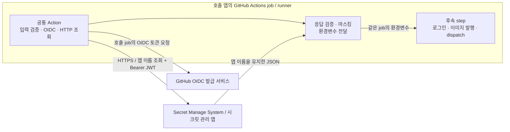

# 공통 GitHub Action 설계와 사용법

상태: 공통 Action `v1.0.0` 게시, SMS 배포와 노션 블로그 CI 전환 적용 완료. 운영 기준일: 2026-09-11.

이 문서는 **C4 Component(L3)를 참고해 호출 job 안의 책임과 외부 인터페이스**를 설명한다. 공통 Action은 앱의 GitHub Actions runner에서 실행하는 JavaScript 구성 요소이며 독립 서버나 상시 컨테이너가 아니다. 클래스·파싱 알고리즘·테스트 코드까지 내려가지 않는다. 시스템 관계는 [전체 설계](../SYSTEM_DESIGN.md), HTTP 계약은 [Secret Manage System 명세](SECRET_MANAGE_SYSTEM.md)를 따른다.

## 역할과 실행 경계

앱 CI가 조회할 앱 이름을 선택하면 Action이 OIDC 토큰 발급, 시크릿 관리 앱 호출, 응답 검증, 마스킹, 환경변수 전달을 맡는다. 앱 이름은 조회 키이며 권한 경계가 아니다. 허용된 레포는 `zot`, `harness` 등 필요한 이름을 자유롭게 조회한다.



입력은 `app` 하나다. 개인용 Action이므로 API 주소 `https://secrets.homelab.robinjoon.xyz`와 audience `urn:homelab:ci-secrets:v1`는 내부 상수로 둔다. 이 주소에서 SMS를 운영한다. 별도 VPN이 필요한 네트워크라면 연결은 호출 job에서 먼저 준비한다. OIDC가 홈서버까지의 네트워크를 만들어 주지는 않는다.

| 책임 | 계약 |
| --- | --- |
| 입력·인증 | `core.getInput('app', {required: true})`와 API의 앱 이름 형식을 검사하고 `core.getIDToken`에 고정 audience를 전달한다. |
| HTTP 조회 | `GET /v1/ci/secrets/{app}`, JWT는 Authorization 헤더로만 보낸다. 리다이렉트를 따르지 않는다. |
| 응답 검증 | 64KiB 이하 JSON, 요청한 앱 이름 하나만 최상위 키로 가진 객체, 내부 키·문자열 제약을 API와 동일하게 검사한다. |
| 환경변수 전달 | 전체 응답과 기존 환경변수 충돌을 먼저 검사한다. 기존 키의 값이 다르거나 이름의 대소문자만 다른 키가 있으면 거부한다. 응답 내부의 대소문자 중복도 거부한다. 정확한 키와 값이 같으면 재사용한다. 모두 통과하면 모든 값을 먼저 마스킹한 뒤 환경변수로 전달한다. |
| 실패 처리 | 인증 실패·잘못된 응답은 step을 실패시킨다. 재시도는 HTTP 429·503에 한정하며 타임아웃과 횟수를 제한한다. JWT·응답 본문·외부 예외 원문은 오류 로그에도 남기지 않는다. |

HTTP 요청은 헤더 수신과 본문 읽기를 합쳐 요청당 10초로 제한하고 최초 요청을 포함해 최대 3회 시도한다. `Retry-After`가 유효한 초 단위 값이면 최대 5초까지 그대로 기다린다. 5초를 넘으면 서버가 지정한 시간보다 일찍 재시도하지 않고 실패한다. 헤더가 없거나 형식이 잘못됐으면 차례로 1초·2초 뒤 재시도한다. 네트워크 오류, 타임아웃, 잘못된 성공 응답과 다른 HTTP 상태에는 재시도하지 않는다. OIDC 토큰 발급을 포함한 Action 전체 실행 제한은 60초다.

마스킹과 전달에는 `core.setSecret`과 `core.exportVariable`을 사용한다. 기존 환경변수와 키·값이 정확히 같아도 현재 step에만 설정된 값일 수 있으므로 후속 step에 전달하도록 다시 export한다.

`${{ secrets.X }}`는 채워지지 않는다. 후속 step은 `${{ env.REGISTRY_PASSWORD }}` 또는 셸의 환경변수를 사용한다. 다른 job, job outputs, artifact, 캐시, 이미지, 실행 중인 k3s 앱으로 자동 전달하지 않는다. 다른 job에서 필요하면 그 job이 다시 조회한다. `source`·`eval`·셸 코드 생성은 사용하지 않는다. 여러 줄 값도 보존한다. 앱별 필수 키는 소비 CI에서 검사한다. [환경변수 전달](https://docs.github.com/en/actions/reference/workflows-and-actions/workflow-commands#setting-an-environment-variable)

마스킹은 로그에서 알려진 값이 표시되는 것을 줄이는 기능이다. 값을 변형하거나 외부로 보내는 코드까지 막아 주지 않으므로 조회 이후 실행하는 코드와 의존성도 신뢰해야 한다. 앱 실행용 Kubernetes Secret 등록·주입 기능은 만들지 않는다.

## 이 레포 안의 구조

```text
.github/actions/load-ci-secrets/
├── action.yml
├── src/
│   ├── index.js
│   └── action.js
├── test/
│   └── *.test.js
├── dist/
│   ├── index.js
│   └── licenses.txt
├── package.json
└── package-lock.json
```

```yaml
name: Load homelab CI secrets
description: Load CI secrets from Secret Manage System
inputs:
  app:
    description: App name to query
    required: true
runs:
  using: node24
  main: dist/index.js
```

`main`은 Action 디렉터리 기준이다. `required: true` 선언만으로 누락 입력이 자동 실패하지 않으므로 위 실행 시 검사가 필요하다. Node 24를 지원하는 GitHub-hosted runner에서 시작한다. [Action metadata와 JavaScript runtime](https://docs.github.com/en/actions/reference/workflows-and-actions/metadata-syntax)

`dist/index.js`에는 `@actions/core` 등 실행 의존성을 함께 번들링한다. 소스·잠금 파일·번들 설정·실행 번들을 같은 변경으로 관리한다. 소비 레포는 npm 설치, `setup-node`, Docker, 별도 저장소나 Marketplace 등록이 필요 없다. Action의 Node 런타임은 runner가 제공한다. Action 개발 시 번들을 만드는 절차와 소비 job의 실행 절차는 구분한다. [JavaScript Action 작성](https://docs.github.com/en/actions/tutorials/create-actions/create-a-javascript-action)

`src/index.js`는 runner의 진입점과 전체 실행 제한을 담당하고 `src/action.js`는 조회·검증·환경변수 전달을 담당한다. `test/*.test.js`는 실제 비밀이나 SMS 접속 없이 더미 응답으로 계약을 검증한다. `dist/licenses.txt`는 번들에 포함한 의존성의 라이선스 고지다.

Action을 수정할 때는 Node 24 환경에서 아래 명령을 실행한다. 소비 앱의 workflow에 넣는 명령이 아니다.

```sh
cd .github/actions/load-ci-secrets
npm ci --ignore-scripts
npm run build
npm test
git diff --exit-code -- dist
```

마지막 명령은 Git이 추적하는 번들과 재생성 결과가 같은지 확인한다. 소스를 변경해 번들이 달라졌다면 변경 내용을 검토하고 소스와 함께 반영한다. 이후 다시 생성한 번들에는 차이가 없어야 한다. 최초 추가라 아직 Git이 추적하지 않는 번들은 이 diff 검사만으로 확인할 수 없으므로 생성 결과를 별도로 검토한다.

이 레포의 [Action 검증 workflow](../.github/workflows/test-load-ci-secrets.yml)도 Node 24에서 의존성 설치, 번들 재생성, 테스트와 번들 차이 검사를 수행한다. CI에서는 새로 생성된 미추적 파일까지 확인해 번들이나 라이선스 파일이 커밋에서 빠진 경우도 거부한다. 권한은 `contents: read`이며 GitHub OIDC 발급이나 실제 SMS 호출은 하지 않는다.

## 다른 레포에서 호출

원격 하위 디렉터리 Action의 문법은 `{owner}/{repo}/{path}@{ref}`다. 따라서 `robinjoon-homelab/Simple-K3S-Herness/.github/actions/load-ci-secrets@main`은 유효하다. 경로는 `action.yml`을 포함한 디렉터리까지 적는다. `ref`는 하네스 레포의 ref이며 호출 앱의 브랜치와 같을 필요가 없다. 운영에서는 `v1.0.0`처럼 버전 태그를 사용한다. 게시한 태그는 이동하지 않고 변경 시 새 버전을 만든다. [원격 Action 문법](https://docs.github.com/en/actions/reference/workflows-and-actions/workflow-syntax#example-using-a-public-action-in-a-subdirectory)

다음은 노션 블로그의 기존 `publish` job에서 **변경할 부분만 발췌한 예시**다. 기존 job 전체를 대체하지 않는다. 두 조회 단계는 공통 Action의 `v1.0.0` 태그를 사용한다.

기존 `verify` job, `push.branches: [master]`, `pull_request`, `workflow_dispatch`, concurrency를 유지한다. `publish`의 timeout, 호스트·이미지 Variables, 불변 이미지 태그도 바꾸지 않는다. checkout → 조회 → 설정 검증 → Buildx 준비·로그인 → 빌드·push → 최신 master 검사·하네스 dispatch 순서를 유지한다.

```yaml
jobs:
  publish:
    if: >-
      github.event_name == 'push' ||
      (github.event_name == 'workflow_dispatch' && github.ref == 'refs/heads/master')
    needs: verify
    runs-on: ubuntu-24.04
    permissions:
      contents: read
      id-token: write
    steps:
      # 기존 앱 checkout 유지
      - name: Load registry credentials
        uses: robinjoon-homelab/Simple-K3S-Herness/.github/actions/load-ci-secrets@v1.0.0
        with:
          app: zot
      - name: Load harness credentials
        uses: robinjoon-homelab/Simple-K3S-Herness/.github/actions/load-ci-secrets@v1.0.0
        with:
          app: harness
      # 기존 설정 검증과 Buildx 준비 유지
      - name: Log in to the home registry
        uses: docker/login-action@dbcb813823bdd20940b903addbd779551569679f
        with:
          registry: ${{ env.REGISTRY_HOST }}
          username: ${{ env.REGISTRY_USERNAME }}
          password: ${{ env.REGISTRY_PASSWORD }}
      # 기존 이미지 빌드·push, 최신 master 검사·하네스 dispatch 유지
```

`id-token: write`는 호출 job에 부여하며 Action이 스스로 권한을 높이지 않는다. OIDC 신원은 **호출한 앱 레포·워크플로**다. 하네스의 Action을 가져와도 하네스 신원으로 바뀌지 않는다. `contents: read`는 Secret 조회가 아니라 앱 checkout에 필요한 기존 권한이다. `permissions`를 명시하면 생략한 권한은 `none`이므로 기존 권한도 함께 보존한다. [OIDC 토큰 발급 권한](https://docs.github.com/en/actions/reference/security/oidc#workflow-permissions-for-the-requesting-the-oidc-token)

기존 검증 step의 `REGISTRY_USERNAME/PASSWORD: ${{ secrets.HOMELAB_REGISTRY_* }}` 설정은 제거한다. 남겨 두면 새 환경변수를 이전 값이나 빈 값으로 덮어쓴다. 검증 step은 레지스트리의 두 키와 `HARNESS_ACTIONS_TOKEN`이 있는지 값을 출력하지 않고 검사한다. 기존 dispatch step에서는 다음 env만 바꾸고 `release-workload-image.yml`, 대상 ref `main`, app/container/tag 입력과 최신 master 검사는 보존한다.

```yaml
env:
  GH_TOKEN: ${{ env.HARNESS_ACTIONS_TOKEN }}
```

`HARNESS_ACTIONS_TOKEN`은 하네스 workflow 실행 권한을 가진 기존 CI 자격증명이며, 원격 Action 코드를 내려받기 위한 토큰은 아니다.

2026-09-01 확인 기준 하네스는 공개 레포(`main`), 노션 블로그도 공개 레포(`master`)다. 원격 Action 자체를 가져오기 위한 별도 checkout·PAT는 필요 없다. 예시의 checkout은 앱 소스 빌드용이다. 호출 레포의 Actions 정책에서 해당 Action 사용을 허용해야 한다. 향후 하네스를 비공개로 바꾸면 같은 Organization의 다른 비공개 레포에 공유하는 설정을 검토해야 하며, 공개 호출 레포에서도 그대로 쓸 수 있다고 가정하지 않는다. [비공개 레포 간 Action 공유](https://docs.github.com/en/actions/how-tos/reuse-automations/share-across-private-repositories)

## 검토 조건과 검증 범위

로컬 테스트는 더미 OIDC·HTTP 응답과 환경변수를 사용해 입력·응답 검증, 충돌 처리, 마스킹 순서, 제한된 재시도와 안전한 실패를 확인한다. 실행 번들 검증은 개발 소스와 배포 파일의 동작 및 재생성 결과를 확인한다. 2026-09-11 [노션 블로그 CI](https://github.com/robinjoon-homelab/Notion-Blog/actions/runs/34603784590)에서 원격 `v1.0.0` 호출, 실제 GitHub OIDC 인증, `zot`·`harness` 조회, 환경변수를 사용한 레지스트리 로그인과 이미지 push를 확인했다. 이어 [하네스 릴리스](https://github.com/robinjoon-homelab/Simple-K3S-Herness/actions/runs/34604228764)도 성공했다. 완료된 CI 로그에서 실제 비밀번호·하네스 토큰·JWT의 평문 노출은 발견되지 않았다.

아래는 통합 검증 기준이다. 노션 블로그의 허용된 master 실행은 운영 환경에서 확인했고, 잘못된 입력·충돌·여러 줄 보존 등은 로컬 테스트로 검증한다. 모든 비허용 실행 조합을 실제 GitHub에서 재현한 것은 아니다.

| 검토 조건 | 실제 통합 시험과 기대 결과 |
| --- | --- |
| A1. job 내부 책임을 설명하고 서버 저장소·클래스 구현을 중복하지 않는다. | 다른 레포에서 게시한 버전 태그로 호출하면 npm 설치 없이 runner에서 실행되고 별도 서버·Docker Action을 기동하지 않는다. |
| A2. `app` 입력·GET 경로·응답 구조가 API 계약과 일치한다. | `test-app`의 가짜 여러 줄 값을 조회하면 후속 step에서 원문과 같다. 입력 누락·다른 앱 이름 응답·중복 JSON 키·초과 크기·잘못된 키는 값을 반영하기 전에 실패한다. |
| A3. 호출자 신원과 권한을 정확히 구분한다. | 허용 job은 성공하고 `id-token: write` 없는 job은 실패한다. 서버가 확인한 레포 ID는 호출 앱의 ID이며 토큰 자체는 출력하지 않는다. |
| A4. 값의 전달 범위와 실패 동작이 명확하다. | 후속 step에서 값 일치를 출력 없이 검사한다. 충돌 값은 실패하고 응답·JWT가 로그와 outputs에 없다. 별도 job에는 값이 없다. |
| A5. 기존 앱 CI 의미와 신뢰 조건을 보존한다. | PR은 publish를 실행하지 않는다. 허용된 master 실행으로 zot 로그인·이미지 push·기존 하네스 dispatch가 성공하고 앱 실행용 Secret은 변경되지 않는다. |

소비 앱을 전환할 때는 기존 CI용 GitHub Secrets를 실제 발행·배포 성공 확인까지 유지하고, 대체된 값만 정리한다. 앱 실행용 Kubernetes Secret과 SMS 자체 배포용 GitHub Secrets는 이 전환 대상이 아니다.

2026-09-11 노션 블로그 전환에서는 Argo CD `Synced/Healthy`, 새 이미지의 Pod 준비 상태와 블로그·readiness HTTP 200까지 확인했다. 이후 대체된 `HOMELAB_REGISTRY_USERNAME`, `HOMELAB_REGISTRY_PASSWORD`, `HARNESS_ACTIONS_TOKEN` GitHub Secrets를 삭제했다. 노션 API용 두 Secret은 유지하며, 임시 자격증명 이전 workflow와 암호화 Artifact·개인키는 제거했다.

2026-09-12 Organization 이전에서는 저장소 ID와 `master`·이벤트 제한을 유지하고 SMS 정책의 소유자 ID·workflow 경로를 새 소유자에 맞췄다. [이전 후 블로그 CI](https://github.com/robinjoon-homelab/Notion-Blog/actions/runs/34698273503)에서 새 경로의 `v1.0.0` Action과 실제 OIDC `zot`·`harness` 조회를 확인했다.

하네스 호출 토큰은 `homelab-harness-release-2026-09`이며 리소스 소유자는 `robinjoon-homelab`이다. `Simple-K3S-Herness` 하나의 Actions 읽기·쓰기와 필수 Metadata 읽기만 허용한다. 운영자 선택에 따라 토큰은 만료 없음을 사용하며, 이를 위해 조직의 fine-grained PAT 만료 강제 정책을 해제했다. SMS의 `harness` 객체와 SMS 자체 CI의 GitHub `HARNESS_ACTIONS_TOKEN`에 같은 값을 보관한다. 토큰을 교체할 때는 두 저장 위치를 함께 갱신한다.

같은 이전 검증에서 [SMS CI](https://github.com/robinjoon-homelab/Secret-Manager-System/actions/runs/34698221033), [SMS 릴리스](https://github.com/robinjoon-homelab/Simple-K3S-Herness/actions/runs/34698380432), [블로그 릴리스](https://github.com/robinjoon-homelab/Simple-K3S-Herness/actions/runs/34698480395)도 성공했다. 두 앱의 Git 이미지 태그와 실제 Deployment 이미지가 일치하고 Argo CD가 `Synced/Healthy`이며, 두 readiness와 블로그 접속은 HTTP 200이었다. SMS 교체 중 일시적인 502가 관찰되어 무중단 배포를 보장하는 결과로 해석하지 않는다. 네 실행의 완료 로그에서 등록된 CI 자격증명과 JWT 형태의 평문은 발견되지 않았다.
