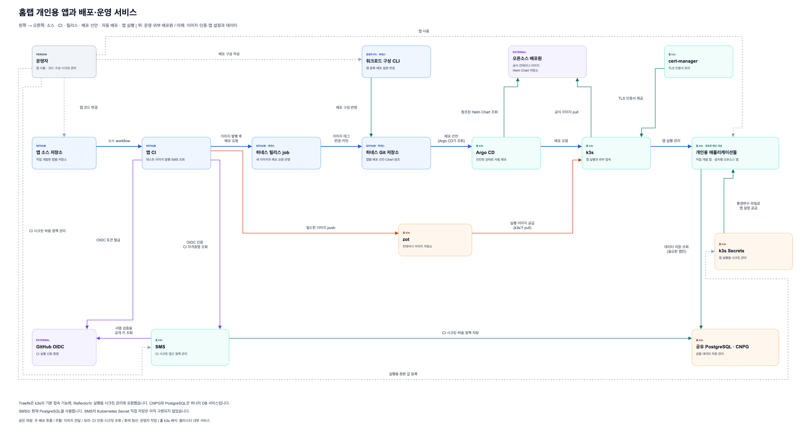

# 홈랩 앱과 배포·운영 서비스

[편집 가능한 draw.io 원본](homelab-application-platform.drawio)

단일 페이지·단일 캔버스 관계도다. 하네스와 앱의 연결을 보여주며, **k3s 내부 서비스는 C1처럼 역할만 가진 하나의 상자**로 표현한다. 실제 프로세스·컨트롤러 구성이나 저장소 내부 구조는 펼치지 않는다.

- Traefik은 k3s의 기본 앱 접속 기능에 포함한다.
- CNPG와 공유 PostgreSQL은 하나의 DB 서비스로 합친다.
- Reflector는 실행용 시크릿 관리에 포함한다.
- Argo CD, zot, cert-manager, k3s Secrets, SMS는 각각 역할만 표시한다.
- 개인용 앱들은 동등한 배포 대상 하나의 그룹으로 표시한다. 특정 앱이 구조의 중심이 되지 않는다.

주 배포 흐름은 왼쪽에서 오른쪽으로 한 줄에 배치한다.

`앱 소스 저장소 → 앱 CI → 하네스 릴리스 job → 하네스 Git 저장소 → Argo CD → k3s → 개인용 애플리케이션들`

- 위쪽에는 운영자의 배포 구성 작업과 외부 배포원·인증서 서비스를 둔다.
- 아래쪽에는 CI에서 k3s로 이어지는 이미지 전달 경로를 둔다.
- OIDC와 SMS는 CI 아래, 실행용 시크릿과 DB는 앱 아래에 둔다.
- 굵은 파란 선은 주 배포 흐름, 회색 점선은 운영자의 직접 작업이다. 인증·시크릿 조회는 보라색, 이미지 전달은 주황색으로 구분한다.

16개 요소와 23개 연결선이 하나의 그래프로 이어진다. 모든 연결선은 직각이며 선 교차·중첩과 다른 노드 관통이 없음을 좌표 검사로 확인했다. 실제 mxGraph 렌더링에서도 상자·라벨 배치를 확인했다. PNG 미리보기는 3540×1890이다.

화살표는 라벨에 적힌 호출·처리·값 공급 방향이다. 주 배포 흐름의 Git → Argo CD와 이미지 경로의 zot → k3s는 정보 공급 방향으로 그렸으며, 실제 조회·pull 주체를 라벨에 명시했다. 응답선과 서비스 내부 동작은 생략했다. 현재 SMS는 PostgreSQL에 CI 시크릿과 허용 정책을 저장하고, SMS 자체 CI는 서비스 중단 중에도 배포할 수 있도록 GitHub Secrets를 사용한다. SMS의 Kubernetes Secret 직접 저장 제안은 현재 구조에 포함하지 않았다.
